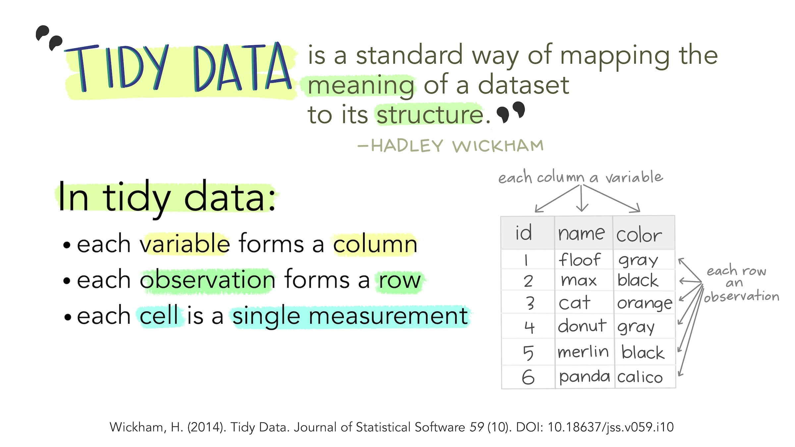

```{r setup, include=FALSE}
knitr::opts_chunk$set(echo = TRUE)
# Setting root.dir allows you to use relative file paths.
# For example you can just write "data/gestures.csv" instead of
# "C://Users/Smruti/projects/MSc/dataviz/data/gestures.csv".
# The here::here() function automatically discovers the main project directory.
knitr::opts_knit$set(root.dir = here::here())
library(tidyverse)
theme_set(theme_minimal())
```

# Tips

- Create one RStudio project per project, i.e. one folder per project.
- From Tools > Global options > General > Basic, untick "Restore .RData into workspace" and choose "Never" in "Save workspace to .Rdata".
- Keep data and code separate.

# Read data

```{r read}
gestures <- read_csv("./02-import-viz/gestures.csv")
```

After reading data make sure you do data checks (such as checking that all the columns are there, that each column is of the right type, that there aren't errors in the data, etc).

A quick look at the tibble.

```{r gest}
gestures
```

Remeber: tidy data is data in which columns are variables and rows are observations.

Sometimes the same data can be thought of as an observation or as a variable. That depends on your analysis or which plot you want to make.



(Find more illustrations here: https://github.com/allisonhorst/stats-illustrations).

# Summaries

Let's just count the number of observations for each background.

```{r}
gestures %>%
  count(background)
```

What if we want to know how many dyads there are per background?

```{r}
gestures %>%
  distinct(dyad, background) %>%
  count(background)
```

Let's get some summaries.

You can use a combination of `group_by()` and `summarise()`.

```{r}
gestures %>%
  group_by(background, gesture) %>%
  summarise(
    count_median = median(count, na.rm = TRUE),
    median_max = max(count, na.rm = TRUE)
  )

gestures %>%
  group_by(background, gesture, months) %>%
  summarise(
    count_median = median(count, na.rm = TRUE),
    median_max = max(count, na.rm = TRUE)
  )
```

# Plots

```{r}
gestures %>%
  ggplot(aes(background, count)) +
  geom_jitter(alpha = 0.5) +
  stat_summary(fun = median, colour = "red", size = 1)

gestures %>%
  filter(count > 0) %>%
  ggplot(aes(background, count)) +
  geom_jitter(alpha = 0.5) +
  stat_summary(fun = median, colour = "red", size = 1)
```


```{r}
gestures %>%
  ggplot(aes(as.factor(months), count)) +
  geom_point() +
  facet_grid(~ background)
```

Let's track each dyad and each task across months 10-11-12, separately for each gesture type.

We can use a "connected points" plot.

```{r}
gestures %>%
  mutate(id = paste(dyad, task, sep = "_")) %>%
  ggplot(aes(as.factor(months), count, group = id)) +
  geom_line(alpha = 0.5) +
  geom_point(alpha = 0.5) +
  facet_grid(gesture ~ background)
```


What if we want to do the same thing but aggregate different tasks together?

```{r}
gestures %>%
  group_by(background,dyad, months, gesture) %>%
  summarise(
    sum_count = sum(count, na.rm = TRUE)
  ) %>%
  ggplot(aes(as.factor(months), sum_count, group = dyad)) +
  geom_line(alpha = 0.5) +
  geom_point(alpha = 0.5) +
  facet_grid(gesture ~ background)
```

What can you see from this plot?
