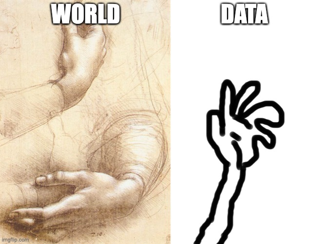

```{r setup, include=FALSE}
knitr::opts_chunk$set(echo = FALSE, message = FALSE, dpi = 300, out.height = "500px", fig.align = "center")
knitr::opts_knit$set(root.dir = here::here())
options(htmltools.dir.version = FALSE)
library(tidyverse)
theme_set(theme_minimal(base_size = 16))
options(ggplot2.discrete.colour = RColorBrewer::brewer.pal(5, "Dark2"))
library(xaringanExtra)
use_xaringan_extra(c("panelset", "tachyons"))
```


class: inverse
background-image: url(../img/time-travel.jpg)
background-size: contain

# Time travel...

---

# Given the .green[formula], find the .orange[points]


## You have:

.f2[$$x = (2, 4, 5, 8, 10, 23, 36)$$]

.f2[$$y = 3 + 2x$$]

## Find:

.f2[$$y$$]


---

# Given the .green[formula], find the .orange[points]

```{r homework}
x <- c(2, 4, 5, 8, 10, 23, 36)
y <- 2 + (3 * x)
line <- tibble(
  x = x,
  y = y
)
ggplot(line, aes(x, y)) +
  geom_point(size = 5) +
  labs(title = bquote(italic(y) == 2 + 3 * italic(x)))
```

---

# Given the .green[formula], find the .orange[points]

```{r line}
ggplot(line, aes(x, y)) +
  geom_point(size = 5, colour = "gray") +
  geom_line(colour = "red") +
  labs(title = bquote(italic(y) == 2 + 3 * italic(x)))
```

---

# Given the .orange[points], find the .green[formula]

## You have:

.f2[$$x = (2, 4, 5, 8, 10, 23, 36)$$]

.f2[$$y = (8, 14, 17, 26, 32, 71, 110)$$]

## Find:

.f2[$$y = ? + ? x$$]

---

# Given the .orange[points], find the .green[formula]

```{r sample}
ggplot(line, aes(x, y)) +
  geom_point(size = 5) +
  labs(title = bquote(italic(y) == "?" + "?" * italic(x)))
```

---

# But...

.pull-left[

]

.pull-right[
.f2[Data is an .red[imperfect] representation of the world!]

Measurements are .red[noisy].
]

---

# Given the .orange[points], find the .green[formula]

```{r sample-noisy}
set.seed(4321)
line$y <- line$y + rnorm(7, 0, 10)
ggplot(line, aes(x, y)) +
  geom_point(size = 5) +
  labs(title = bquote(italic(y) == "?" + "?" * italic(x)))
```

---

# Now enter Linear Models

<div style="width:100%;height:0;padding-bottom:42%;position:relative;"><iframe src="https://giphy.com/embed/3owzVYjZSzuFivWpHi" width="100%" height="100%" style="position:absolute" frameBorder="0" class="giphy-embed" allowFullScreen></iframe></div>

???

[via GIPHY](https://giphy.com/gifs/starwars-movie-star-wars-3owzVYjZSzuFivWpHi)

---

# Linear model: the basics

```{r lm-plot}
ggplot(line, aes(x, y)) +
  geom_point(size = 5, ) +
  geom_abline(intercept = 10, slope = 1, size = 2, colour = "blue", alpha = 0.2) +
  geom_abline(intercept = 30, slope = 2, size = 2, colour = "blue", alpha = 0.2) +
  geom_abline(intercept = -20, slope = 4, size = 2, colour = "blue", alpha = 0.2) +
  geom_abline(intercept = 15, slope = 6, size = 2, colour = "blue", alpha = 0.2) +
  geom_abline(intercept = 2, slope = 3, size = 2, colour = "blue", alpha = 0.2) +
  labs(title = bquote({italic(y) == "?" + "?" * italic(x)}))
```

---

# Linear model: the basics

```{r lm-plot-2}
ggplot(line, aes(x, y)) +
  geom_point(size = 5, ) +
  geom_abline(intercept = 10, slope = 1, size = 2, colour = "blue", alpha = 0.2) +
  geom_abline(intercept = 30, slope = 2, size = 2, colour = "blue", alpha = 0.2) +
  geom_abline(intercept = -20, slope = 4, size = 2, colour = "blue", alpha = 0.2) +
  geom_abline(intercept = 15, slope = 6, size = 2, colour = "blue", alpha = 0.2) +
  geom_abline(intercept = 2, slope = 3, size = 2, colour = "blue") +
  labs(title = bquote({italic(y) == "?" + "?" * italic(x)}))
```

---

# Linear model: the basics


.f1[
$$y = ? + ? x$$
]

---

# Linear model: the basics


.f1[
$$y = \beta_0 + \beta_1x$$
]

<br>

--

.f2[
$$\beta_0 = intercept$$
$$\beta_1 = slope$$
]

--

<br>

We know $x$ and $y$ and we need to .green[estimate] $\beta_0$ and $\beta_1$.

---

# Linear model: the basics

```{r sample-2}
x <- sample(1:100, 50)
y <- 2 + (3 * x) + rnorm(length(x), 0, 10)

line <- tibble(x, y)

ggplot(line, aes(x, y)) +
  geom_point(size = 5) +
  labs(title = bquote(italic(y) == "?" + "?" * italic(x)))
```

---

# Linear model: the basics

```{r lm, echo=TRUE}
line_lm <- lm(y ~ x, data = line)
summary(line_lm)
```

---

# Linear model: the basics

```{r line-model}
ggplot(line, aes(x, y)) +
  geom_point(size = 5, alpha = 0.5) +
  geom_abline(intercept = 2, slope = 3, size = 2) +
  labs(title = bquote(italic(y) == "2" + "3" * italic(x)))
```

---

# Categorical predictors

```{r categorical}
n <- 100
x <- rnorm(n)
group <- rep(c("A", "B"), each = n / 2)
y <- ifelse(group == "A", 2 + 3 * x, 2 + 3 * x + 6) + rnorm(n, 0, 1)

line_groups <- tibble(
 x, y, group
)

ggplot(line_groups, aes(x, y, colour = group)) +
  geom_point(size = 5, alpha = 0.8) +
  # labs(title = bquote(italic(y) == "2" + "3" * italic(x))) +
  theme(legend.position = "bottom")
```

---

# Categorical predictors

```{r categorical-2}
ggplot(line_groups, aes(x, y, colour = group)) +
  geom_point(size = 5, alpha = 0.8) +
  geom_abline(intercept = 2, slope = 3, size = 2) +
  geom_abline(intercept = 2 + 6, slope = 3, size = 2) +
  # labs(title = bquote(italic(y) == "2" + "3" * italic(x))) +
  theme(legend.position = "bottom")
```

---

# Categorical predictors


.f1[
$$y = \beta_0 + \beta_1x + \beta_2group$$
]

<br>

--

.f2[
$$\beta_0 = \text{intercept}$$
$$\beta_1 = \text{coefficient for } x$$
$$\beta_2 = \text{coefficient for } group$$
]

--

<br>

We know $x$, $y$ and $group$ (`A` or `B`) and we need to .green[estimate] $\beta_0$, $\beta_1$ and $\beta_2$.

---

class: center middle inverse

# But $group$ is not numeric!!!

--

# So we make it...

---

# Dummy coding

.f3[
|     | group    |
| --- | -------: |
| A   | 0        |
| B   | 1        |
]

<br>

$$y = \beta_0 + \beta_1x + \beta_2group$$

<br>

--

$$y(group = A) = \beta_0 + \beta_1x + \beta_2 \cdot 0 = \beta_0 + \beta_1x$$

<br>

--

$$y(group = B) = \beta_0 + \beta_1x + \beta_2 \cdot 1 =  \beta_0 + \beta_1x + \beta_2$$

$$= \beta_0 + \beta_2 + \beta_1x$$


---

# Categorical predictors

```{r lm-group, echo=TRUE}
group_lm <- lm(y ~ x + group, data = line_groups)
summary(group_lm)
```

---

# Interactions

```{r interactions}
n <- 100
x <- rnorm(n)
group <- rep(c("A", "B"), each = n / 2)
y <- ifelse(group == "A", 2 + 3 * x, 2 + (3 + -2) * x + 6) + rnorm(n, 0, 1)

line_groups <- tibble(
 x, y, group
)

ggplot(line_groups, aes(x, y, colour = group)) +
  geom_point(size = 5, alpha = 0.8) +
  # labs(title = bquote(italic(y) == "2" + "3" * italic(x))) +
  theme(legend.position = "bottom")
```

---

# Interactions

```{r interactions-2}
ggplot(line_groups, aes(x, y, colour = group)) +
  geom_point(size = 5, alpha = 0.8) +
  geom_abline(intercept = 2, slope = 3, size = 2) +
  geom_abline(intercept = 2 + 6, slope = 3 - 2, size = 2) +
  # labs(title = bquote(italic(y) == "2" + "3" * italic(x))) +
  theme(legend.position = "bottom")
```

---

# Interactions


$$y = \beta_0 + \beta_1 \cdot x + \beta_2 \cdot group + \beta_3 \cdot x \cdot group$$

<br>

--

$$y(group = A) = \beta_0 + \beta_1 \cdot x + \beta_2 \cdot 0 + \beta_3 \cdot x \cdot 0 = \beta_0 + \beta_1 \cdot x$$

<br>

--

$$y(group = B) = \beta_0 + \beta_1 \cdot x + \beta_2 \cdot 1 + \beta_3 \cdot x \cdot 1$$

$$= \beta_0 + \beta_2 + \beta_1 \cdot x + \beta_3 \cdot x$$

<br>

--

We know $x$, $y$ and $group$ (`A` or `B`) and we need to .green[estimate] $\beta_0$, $\beta_1$, $\beta_2$ and $\beta_3$.


---

# Interactions

```{r lm-interaction, echo=TRUE}
interaction_lm <- lm(y ~ x + group + x:group, data = line_groups)
summary(interaction_lm)
```

---

# Interactions

$$y = \beta_0 + \beta_1 \cdot x + \beta_2 \cdot group + \beta_3 \cdot x \cdot group$$
$$y = 1.95 + 3.35 \cdot x + 5.86 \cdot group + (-2.19) \cdot x \cdot group$$

<br>

--

$$y(group = A) = 1.95 + 3.35 \cdot x + 5.86 \cdot 0 + (-2.19) \cdot x \cdot 0$$

$$= 1.95 + 3.35 \cdot x$$

<br>

--

$$y(group = B) =  1.95 + 3.35 \cdot x + 5.86 \cdot 1 + (-2.19) \cdot x \cdot 1$$

$$= 1.95 + 3.35 \cdot x + 5.86 + (-2.19) \cdot x$$

<br>

---

# Interactions

```{r lm-interaction-2}
summary(interaction_lm)
```
