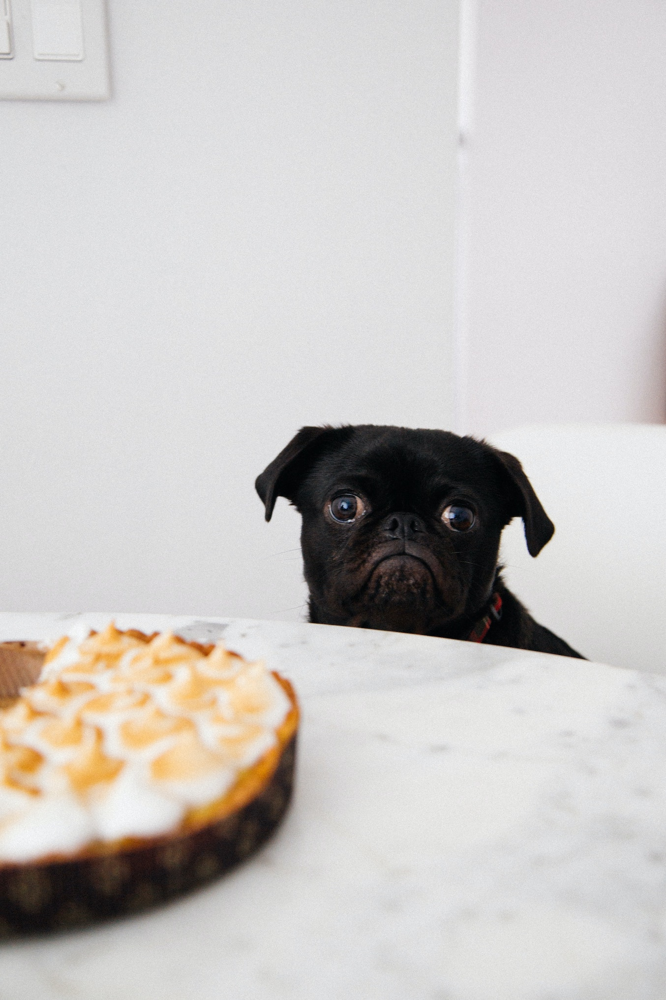
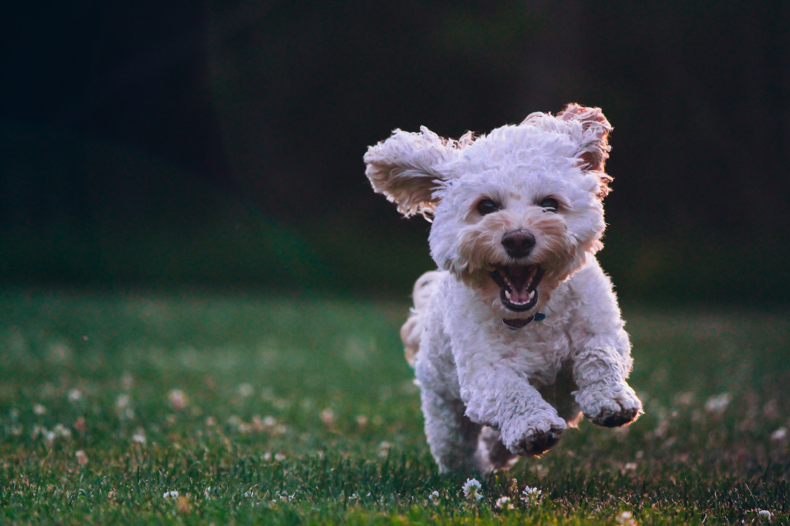
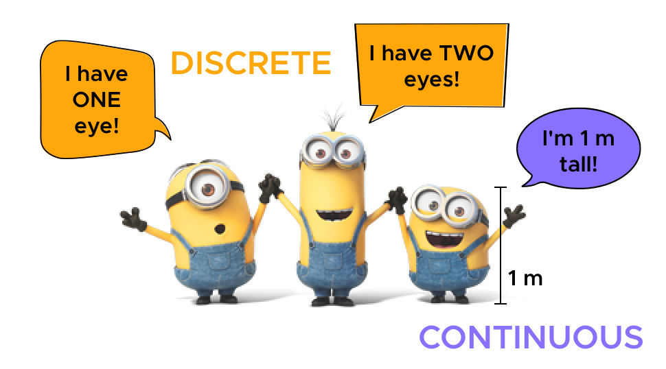

```{r setup, include=FALSE}
knitr::opts_chunk$set(echo = FALSE, message = FALSE, dpi = 300, fig.width = 7, fig.height = 5, out.height = "500px", fig.align = "center")
knitr::opts_knit$set(root.dir = here::here())
options(htmltools.dir.version = FALSE)
library(tidyverse)
theme_set(theme_minimal(base_size = 16))
options(ggplot2.discrete.colour = RColorBrewer::brewer.pal(5, "Dark2"))
library(xaringanExtra)
use_xaringan_extra(c("panelset", "tachyons"))
library(ggeffects)
options(show.signif.stars = FALSE)
```

# Summary from last time

* The simplest .orange[**linear model**] is a straight line.

$$y = \beta_0 + \beta_1 x$$

* We want to estimate the $\beta_n$ .orange[**coefficients**].

$$y = \beta_0 + \beta_1 x_1 + \beta_2 x_2 + \beta_4 x_1 x_2 + \beta_3 x_3$$

* Categorical predictors are .orange[dummy coded].

* .orange[**Interactions**] model differences of the effects of the predictors on the outcome across groups/conditions.

---

class: center middle



???

Photo by <a href="https://unsplash.com/@charlesdeluvio?utm_source=unsplash&utm_medium=referral&utm_content=creditCopyText">charlesdeluvio</a> on <a href="https://unsplash.com/s/photos/sad-puppy?utm_source=unsplash&utm_medium=referral&utm_content=creditCopyText">Unsplash</a>
  
---

class: center middle



???

Photo by <a href="https://unsplash.com/@joeyc?utm_source=unsplash&utm_medium=referral&utm_content=creditCopyText">Joe Caione</a> on <a href="https://unsplash.com/s/photos/happy-puppy?utm_source=unsplash&utm_medium=referral&utm_content=creditCopyText">Unsplash</a>

---

# Exercise 1

```{r art-rate}
polite <- read_csv("04-fit-models/polite.csv") %>%
  mutate(
    attitude = factor(attitude, levels = c("inf", "pol")),
    musicstudent = factor(musicstudent, levels = c("no", "yes"))
  )

art_lm_1 <- lm(articulation_rate ~ attitude * musicstudent, data = polite)

summary(art_lm_1)
```

---

# Exercise 1

```{r art-rate-plot}
ggpredict(art_lm_1, terms = c("attitude", "musicstudent")) %>%
  plot() +
  theme(text = element_text(size = 20))
```

---

# Exercise 2

```{r f0}
f0_lm_1 <- lm(f0mn ~ attitude * years_in_ger, data = polite)

summary(f0_lm_1)
```

---

# Exercise 2

```{r f0-plot}
ggpredict(f0_lm_1, terms = c("attitude", "years_in_ger [1,3,6,9]")) %>%
  plot() +
  theme(text = element_text(size = 20))
```

---

# Exercise 3

```{r ct}
gestures <- read_csv("04-fit-models/gestures.csv")

ct_lm_1 <- lm(ct ~ count * gesture * background, data = gestures)

summary(ct_lm_1)
```

---

# Exercise 3

```{r ct-plot}
ggpredict(ct_lm_1, terms = c("count", "gesture", "background")) %>%
  plot() +
  theme(text = element_text(size = 20))
```

---

# Do you notice something weird?

```{r ct-plot-2}
ggpredict(ct_lm_1, terms = c("count", "gesture", "background")) %>%
  plot() +
  theme(text = element_text(size = 20))
```

---

class: center middle inverse

# Probability distributions

---

# Continuous vs discrete

.center[

]

---

class: center middle

.f1.link.dim.br3.ph3.pv2.mb2.dib.white.bg-purple[
[.white[Probability distributions app]](https://seeing-theory.brown.edu/probability-distributions/index.html#section2)
]

---

# Gaussian distribution (aka normal distribution)

```{r norm, echo=TRUE}
x_norm <- rnorm(10, mean = 0, sd = 1)
x_norm
```

---

# Gaussian distribution (aka normal distribution)

```{r norm-plot, echo=TRUE}
plot(density(x_norm))
```

---

# Bernoulli distribution (special case of Binomial)

```{r bern, echo=TRUE}
x_bern <- rbernoulli(20, p = 0.75)
x_bern

table(x_bern)
```

---

class: center middle inverse

# Think about the probability distribution of the outcome variable

---

# Continuous outcome variable

* The variable can take on *any positive and negative real number, including 0*: **Gaussian** (aka normal) distribution.

    * There are very few truly Gaussian variables, although in some cases one can speak of "approximate" or "assumed" normality.

    * This family is fitted by default in `lm()`, `lme4::lmer()` and `brms::brm()`.

--

* The variable can take on *any positive number only*: **Log-normal** distribution.

    * Duration of segments, words, pauses, etc, are known to be log-normally distributed.

    * Measurements taken in Hz (like f0, formants, centre of gravity, ...) could be considered to be log-normal.

    * There other families that could potentially be used depending on the nature of the variable: exponential-Gaussian (reaction times), gamma, ...

---

# Continuous outcome variable

* The variable can take on *any number between 0 and 1, but not 0 nor 1*: **Beta** distribution.

    * Proportions fall into this category (for example proportion of voicing within closure), although 0 and 1 are not allowed in the beta distribution.

--

* The variable can take on *any number between 0 and 1, including 0 or 0 and 1*: **Zero-inflated** or **Zero/one-inflated beta** (ZOIB) distribution.

    * If the proportion data includes many 0s and 1s, then this is the ideal distribution to use. ZOIB distributions are somewhat more difficult to fit than a simple beta distribution, so a common practice is to transform the data so that it doesn't include 0s nor 1s (this can be achieved using different techniques, some better than others).

---

# Discrete outcome variable

* The variable is *counts*: **Poisson** distribution.

    * Counts of words, segments, gestures, f0 peaks, ...
    
--

* The variable is *dichotomous*, i.e. it can take one of two levels: **Bernoulli** distribution.

    * Categorical outcome variables like yes/no, correct/incorrect, voiced/voiceless, follow this distribution.

    * This family is fitted by default when you run `glm(family = binomial)`, aka "logistic regression" or "binomial regression".

--

* The variable is a *scale*: **ordinal** linear model.

    * Likert scales and ratings, language attitude questionnaires.

    * Ordinal linear models, a.k.a. ordinal logistic regression, can be fitted with the [ordinal](https://cran.r-project.org/web/packages/ordinal/index.html) and the [brms](https://paul-buerkner.github.io/brms/) package.

---

```{r ct-2}
ct_lm_2 <- glm(ct ~ count * gesture * background, data = gestures, family = poisson())
```


---

```{r ct-2-plot}
ggpredict(ct_lm_2, terms = c("count [0:5 by=0.01]", "gesture", "background")) %>%
  plot()
```


---

# Counts (Poisson)

```{r log-odds}
tibble(
  log_odds = seq(-2, 2, by = 0.001),
  odds = exp(log_odds)
) %>%
  ggplot(aes(log_odds, odds)) +
  geom_vline(xintercept = 0, alpha = 0.5) +
  geom_hline(yintercept = 1, linetype = "dashed") +
  geom_hline(yintercept = 0, size = 1, colour = "#8856a7") +
  geom_line(size = 2) +
  geom_point(x = 0, y = 1, size = 4) +
  scale_y_continuous(breaks = seq(0, 6, by = 1), minor_breaks = NULL) +
  labs(
    title = "Correspondence between log-odds and odds",
    x = "log-odds",
    y = "odds"
  )
```

---

# Dichotomous outcome (Bernoulli)

```{r p-log-odds}
dots <- tibble(
  p = seq(0.1, 0.9, by = 0.1),
  log_odds = qlogis(p)
)

tibble(
  p = seq(0, 1, by = 0.001),
  log_odds = qlogis(p)
) %>%
  ggplot(aes(log_odds, p)) +
  geom_hline(yintercept = 0.5, linetype = "dashed") +
  geom_hline(yintercept = 0, colour = "#8856a7", size = 1) +
  geom_hline(yintercept = 1, colour = "#8856a7", size = 1) +
  geom_vline(xintercept = 0, alpha = 0.5) +
  geom_line(size = 2) +
  geom_point(data = dots, size = 4) +
  scale_x_continuous(breaks = seq(-6, 6, by = 2), minor_breaks = NULL) +
  scale_y_continuous(breaks = seq(0, 1, by = 0.1), minor_breaks = NULL) +
  labs(
    title = "Correspondence between log-odds and probabilities",
    x = "log-odds",
    y = "probability"
  )
```
